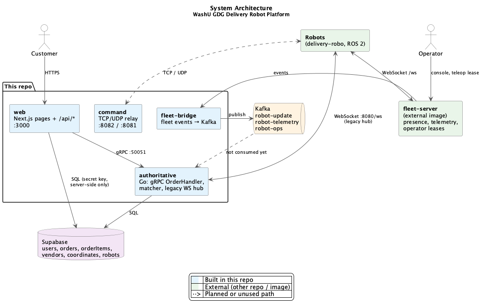
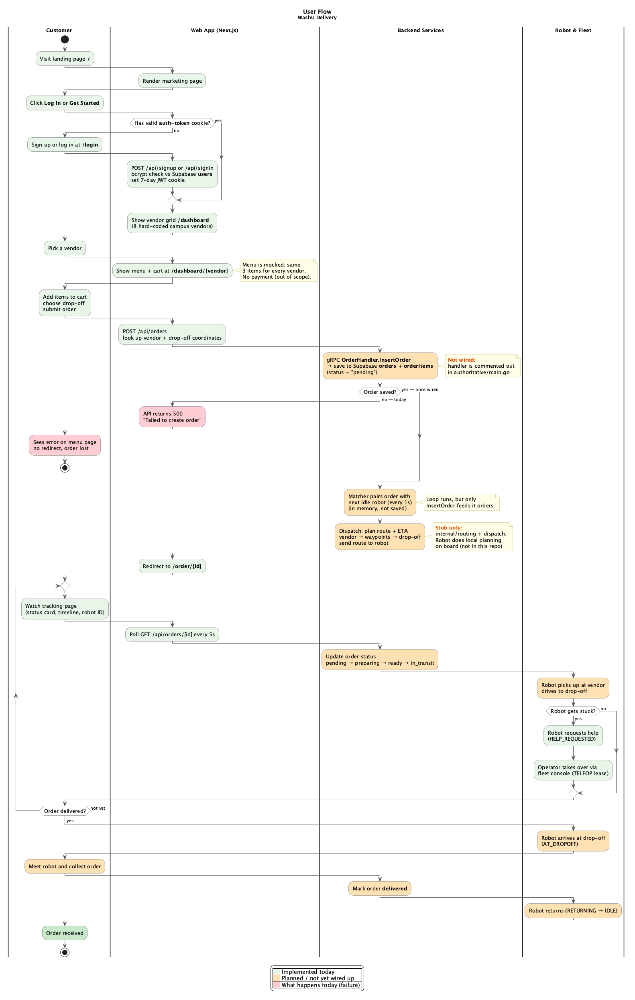

# Architecture

How the pieces of the delivery platform fit together. For what is actually working today,
see [STATUS.md](STATUS.md). This page describes the design and points out where the code
doesn't match it yet.

## System overview

Source: [diagrams/system-architecture.puml](diagrams/system-architecture.puml).
Re-render after editing a diagram with `plantuml -tpng docs/diagrams/*.puml`.

## The order, end to end

Source: [diagrams/customer-order-user-flow.puml](diagrams/customer-order-user-flow.puml).
Green steps are implemented, orange are planned, red is what happens today when an order is
submitted.

In words:

1. The customer logs in on the web app and picks a vendor and a drop-off point.
2. The web app's `POST /api/orders` route looks up the vendor and drop-off in Supabase and
   calls `OrderHandler.InsertOrder` on **authoritative** over gRPC.
3. Authoritative saves the order and queues it in the **matcher**, which pairs the oldest
   order with the next idle robot once a second.
4. *(Planned)* Dispatch computes a route (A* over a campus graph, Linear DSC-32/33/37) and
   sends it to the robot. The robot does its own local navigation onboard
   ([delivery-robo](https://github.com/WUSTL-Delivery/delivery-robo)).
5. The customer's tracking page polls `GET /api/orders/[id]` every 5 s.
6. If a robot gets stuck it raises a help request on **fleet-server**, and an operator takes
   over through the fleet console (a teleop *lease*).
7. *(Planned)* The robot reaches the drop-off, the customer collects the order, and the order
   is marked `delivered`.

## Services

| Service | Code | Listens on (local) | Role |
|---------|------|--------------------|------|
| web | `apps/client/web` | 3000 | Next.js customer site and the `/api/*` routes. The only thing the browser talks to. |
| authoritative | `apps/authoritative` | 50051 (gRPC), 8080 (WS) | Order service, order-to-robot matcher, legacy robot WebSocket hub. |
| command | `apps/command` | 8082/tcp, 8081/udp | Generic TCP/UDP relay for real-time messages. No dispatch logic yet. |
| fleet-server | external image `ghcr.io/wustl-delivery/fleet-server` | 8090 | Robot connectivity, presence, telemetry and the operator intervention queue and console. From [fleet-platform](https://github.com/WUSTL-Delivery/robo-fleet-platform). |
| fleet-bridge | `apps/fleet-bridge` | none (client only) | Subscribes to fleet-server and republishes events to Kafka. One direction only. |
| kafka + kafka-ui | `deployments/docker-compose.yml` | 9092, 8085 (UI) | Event bus for robot events. |
| Supabase | hosted | n/a | Postgres database shared by web and authoritative. |

Full port table and production setup: [deployments/README.md](../deployments/README.md).

## How the services talk

| From → To | Protocol | Contract |
|-----------|----------|----------|
| Browser → web | HTTPS, JSON | `app/api/*/route.ts` |
| web → authoritative | gRPC | `apps/authoritative/proto/order_service.proto` (`OrderHandler`); client in `apps/client/web/lib/grpc-client.ts` |
| web → Supabase | supabase-js with the secret key, server-side only | `apps/client/web/components/supabase.ts` |
| authoritative → Supabase | supabase-go | `apps/authoritative/pkg/db.go` |
| Robot ↔ authoritative | WebSocket `/ws` on :8080 | Robot sends `{type:"update", payload:{robot_id, status}}`; hub replies `{robot_id, order_id}` on a match. `internal/wsockets/` |
| Robot ↔ fleet-server | WebSocket `/ws` | fleet-platform protocol; see `fleet-platform/docs/INTEGRATION.md` |
| fleet-bridge → Kafka | Kafka topics `robot-update`, `robot-telemetry`, `robot-ops` | Message shapes in [apps/fleet-bridge/README.md](../apps/fleet-bridge/README.md) |

The robot currently has **two** connections: the legacy hub (which the matcher uses) and
fleet-server (presence and operator help). The plan is to move dispatch onto the
fleet-platform SDK and retire the hub (Linear DSC-28).

## Data (Supabase tables)

| Table | Used by | Holds |
|-------|---------|-------|
| `users` | web (`/api/signup`, `/api/signin`) | Accounts with bcrypt password hashes |
| `vendors` | web, authoritative | Campus vendors |
| `coordinates` | web, authoritative | Named points: type 1 = vendor, 2 = drop-off, 3 = waypoint (`pkg/db.go`) |
| `orders` | web, authoritative | `userId`, `vendorId`, `status`, `dropOffLocation`, `robotId` |
| `orderItems` | web, authoritative | Line items per order: name, quantity, price |
| `robots` | authoritative (`pkg/db.go`) | Robot records |

`orders.status` is a free-form string, not an enum. The client sends `pending`, and the
tracking page knows `pending`, `preparing`, `ready`, `in_transit`, `delivered` and
`cancelled`.

## Auth

Auth is custom and doesn't use Supabase Auth. `/api/signin` checks the bcrypt hash in `users`
and sets a 7-day JWT in an httpOnly `auth-token` cookie, signed with `JWT_SECRET`.
`apps/client/web/proxy.ts` (the Next 16 version of middleware) protects `/dashboard`,
`/profile` and `/settings`. The order APIs and `/order/[id]` aren't protected yet.

## Robot lifecycle (design)

The robot states in `apps/authoritative/internal/state/model.go` are UNKNOWN, IDLE, ASSIGNED,
MOVING_TO_PICKUP, AT_PICKUP, MOVING_TO_DROPOFF, AT_DROPOFF, RETURNING, CHARGING, OFFLINE,
ERROR and MAINTENANCE. The transitions are in [tdd.pdf](tdd.pdf), Appendix A. The state
manager isn't started by `main` yet.

fleet-server separately tracks AUTONOMOUS, HELP_REQUESTED and TELEOP for operator
intervention.

## Further reading

- [tdd.pdf](tdd.pdf) / `tdd.tex`: the original technical design. Its goals and use cases
  still hold; the API, data and failure sections are incomplete.
- [deployments/README.md](../deployments/README.md): running and deploying, fleet-server
  enrollment keys and `fleetctl`.
